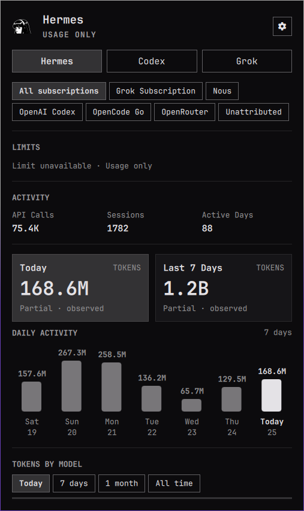

# AI Agents Usage for Omarchy

A native Omarchy bar widget and panel for local usage, limits, pace, recent history, and model statistics from available Claude Code, Codex, Fireworks, Hermes, and Grok records.

## What it does

- Shows available local AI-agent usage records in one bar widget for Claude Code, Codex, Fireworks, Hermes, and Grok.
- Claude Code, Codex, Fireworks, Hermes, and Grok provider slots are enabled by default; other providers can appear through standard records and Hermes route discovery.
- Displays limits, today and last-7-days token cards, a daily activity chart, and model token breakdowns with four model-period filters: **Today**, **7 days**, **1 month** (rolling 30 days), and **All time**.
- Normalizes provider limit records to show only windows actually supplied by upstream providers (session/5-hour, weekly, monthly, reset times, used/limit/remaining, and plan labels).
- Shows a truthful "Limit unavailable / usage-only" status when a provider lacks a safe official quota source, preserving local usage metrics without fabricating quotas.
- Collects Hermes TUI usage from the local `~/.hermes/state.db` database in read-only mode.
- Collects Grok CLI usage from documented per-session `usage.json` files under `$GROK_HOME/sessions` (default `~/.grok/sessions`). SuperGrok and X Premium+ weekly/monthly reset meters come from the signed-in Grok CLI over ACP; a reported billing period with an omitted credit percentage reads as zero usage for that period, while SuperGrok Heavy's absent percentage stays unknown. If Omarchy later ships `omarchy-agent-usage-grok`, this plugin defers to that packaged collector and does not write `grok.json` itself.
- Automatically discovers Hermes provider/subscription routes from recorded models and usage, grouping all models and metrics under safe route identities (such as OpenAI Codex, OpenCode Go, Grok API, Grok Subscription, Google Gemini, Anthropic, OpenRouter, and Nous). Hermes’ `xai-oauth` route remains distinct from the API-key `xai` route and is shown as **Grok Subscription**.
- Keeps Hermes API transport modes (e.g., chat_completions, codex_responses, anthropic_messages) aggregated under their respective provider identities without splitting one identity. Distinct identities such as `xai` and `xai-oauth` remain separate.
- Never infers subscriptions from model names alone (for example, grok-4.6 routed through OpenCode Go remains OpenCode Go).
- Writes Hermes’ display record to the user’s local `~/.local/state/omarchy/agents/usage/hermes.json`.
- Writes Grok’s display record to `~/.local/state/omarchy/agents/usage/grok.json` when the packaged Omarchy Grok collector is absent.
- The Hermes and Grok collectors never read or send prompt text, message content, API keys, or credentials. Grok SuperGrok weekly/monthly meters come from the Grok CLI (`grok agent --no-leader stdio`, `_x.ai/billing`); the collector does not read `auth.json` or call billing URLs itself.
- Claude Code, Codex, and Fireworks records are collected through Omarchy’s existing provider tools.
- Optional cross-device aggregation is off by default and is enabled only through the user’s explicit widget settings. Snapshot scans are bounded (at most 64 files, 256 KiB per file, 2 MiB per scan); oversized, empty, non-regular, and symlinked entries are skipped, and skipped or truncated input is reported in the panel instead of being loaded. Provider-record discovery likewise runs through a bounded listing helper that streams the directory one entry at a time (at most 256 names emitted from at most 1024 entries examined), and capped scans are reported instead of silently shortened.

The plugin runs with the user’s normal desktop permissions inside the Omarchy shell. Review the source before enabling it, as with every third-party Omarchy plugin.

## Hermes subscription routes

When your local Hermes installation records usage across backend providers, a nested route option bar appears within the Hermes tab:

- **Automatic discovery & local-only selector**: The option bar discovers routes directly from models and billing providers in local Hermes usage. It allows switching between "All subscriptions" and specific discovered route groups (e.g., OpenAI Codex, OpenCode Go, Grok API, Grok Subscription, Google Gemini, Anthropic, or Unattributed), filtering the Hermes summary, token cards and daily activity chart, activity metrics (API calls, sessions, active days), and model breakdown. This selector and its route data stay local to the machine running Hermes; route/subscription fields are omitted from synced snapshots and are never transmitted or merged across synced devices.
- **Transport mode aggregation**: Transport modes (such as `chat_completions`, `codex_responses`, `anthropic_messages`) are treated as API transport channels rather than subscriptions, and do not divide a single provider subscription into separate routes.
- **Strict attribution boundaries**: Subscriptions are never inferred from model names alone. Missing, unknown, URL-like, or secret-like metadata safely collapses into an explicit Unattributed fallback.
- **Meaning and local accounting**: Route metrics are calculated entirely from the local `~/.hermes/state.db` database (`session_model_usage`). There is no remote quota, plan, balance, or rate-limit lookup against provider APIs. If you configure multiple accounts that share the exact same provider identifier, their metrics are grouped under that provider route.

## Model-token periods

The **TOKENS BY MODEL** section defaults to **Today** and offers four local-calendar filters: **Today**, **7 days**, **1 month** (today plus the previous 29 days), and **All time**. The panel renders all valid models in the selected period; it does not silently truncate the list.

Hovering any model row opens a small card with the tokens behind that model's total: **In**, **Out**, **Cache read**, and **Cache write**, with an em dash for a bucket the record does not report. Records without per-bucket detail show a single Total row instead.

- Hermes publishes exact per-model period totals directly from its read-only usage tables.
- Older/native provider records that expose only current-day and cumulative model totals are tracked by the local hidden `~/.local/state/omarchy/agents/usage/.model-history.json` sidecar. It reads standard usage records only, keeps at most 31 daily buckets, and begins 7-day/month coverage at the first safe observation; it never assigns historical all-time totals to the first day.
- The sidecar is local-only, mode `0600`, atomic, and contains only bounded provider/model token aggregates. It never reads transcripts, prompts, conversations, databases, credentials, or endpoints. Native provider records remain authoritative whenever they publish a period.
- Providers that do not publish model-token history show a generic unavailable message; quota and credit fields are never relabeled as token usage.

## Interface example

The panel combines provider tabs, today and last-7-days token cards, a daily activity chart, and a model-level token breakdown. The values shown below are real local usage statistics from the captured demo machine; every installation displays its own local records.



## Requirements

- Omarchy Quattro with the Omarchy shell running.
- Python 3 for Hermes collection.
- Omarchy’s built-in agent usage tools for Claude Code, Codex, and Fireworks records.
- A local Grok CLI home (`~/.grok` or `$GROK_HOME`) for the Grok tab when Omarchy has not yet shipped `omarchy-agent-usage-grok`.
- A Hermes installation and local `~/.hermes/state.db` are needed for Hermes statistics; the widget remains usable without Hermes.

## Install

```bash
omarchy plugin add https://github.com/Murali-lns/omarchy-agents-usage.git --enable
```

The standard Omarchy plugin command clones and validates the repository. It runs with ordinary user permissions and this repository has no install hook.

## Remove

```bash
omarchy plugin remove io.github.murali-lns.agents-usage
```

Removing the plugin removes only its installed plugin directory and shell entry. It does not remove Hermes data, agent records, or user configuration.

## Update

```bash
omarchy plugin update io.github.murali-lns.agents-usage
```

## Manual refresh

```bash
omarchy-shell io.github.murali-lns.agents-usage refresh
```

## Process boundary

Every command the plugin runs — the collectors, the shared Omarchy updater, the sync helpers, the directory listing, and the process-group reaper itself — is launched through a supervisor (`supervised-run.sh`):

- **Dedicated process group per command.** The supervisor re-execs itself through the pinned `/usr/bin/setsid` so the direct child leads its own process group and session (PID == PGID == SID), re-verifies that ownership from `/proc` before the command runs, and refuses to run anything otherwise. A hard deadline TERMs the child; the supervisor traps that signal and forwards TERM to its entire group (the command pipeline runs backgrounded so the trap fires promptly, and the trap disarms its own handler first so the group-wide signal cannot race the exit path). The bounded reaper (`reap-group.sh`) validates group ownership again and completes the KILL escalation of exactly that group — so no descendant survives a timeout, even if the reaper itself were unavailable. Reap requests are serialized through a queue: the single reaper process is never reconfigured mid-run, so overlapping timeouts each get their own cleanup.
- **Producer-side stream caps.** stdout and stderr are each relayed through a pinned `head -c` cap (256 KiB per stream) before they can reach the long-lived shell process, so a flooding child is severed at the pipe instead of being buffered. The sync scan has its own wider cap above the helper's 2 MiB budget.
- **No PATH resolution.** Every binary and interpreter is invoked by absolute trusted path (`/usr/bin/bash`, `/usr/bin/python3`, `/usr/bin/setsid`, `/usr/bin/head`, the Omarchy updater under `/usr/share/omarchy`), children get a cleared environment plus an explicit `HOME` only, and no shebang is ever consulted.

## Privacy and data boundaries

The Hermes collector reads only the active Hermes database path selected by `HERMES_HOME`, or `~/.hermes/state.db` when that variable is unset. It filters to TUI sessions and aggregates counts and token totals by model and discovered provider route. The model-history sidecar reads only standard Omarchy usage JSON records and stores bounded local period totals; it never opens a provider database or transcript. Route/subscription data remains local-only and is deliberately omitted from synced snapshots; synced aggregation contains provider-level count and model totals only. The cross-device scan helper reads at most 64 snapshot files of 256 KiB each within a 2 MiB per-scan budget, rejects symlinked and non-regular entries, and bounds every parsed array, key, string, and number before merging. The repository contains no user database, generated usage JSON, shell configuration, cache, credential, API key, prompt, or message content.

## License and attribution

This project is MIT-licensed. Parts of the QML widget are adapted from Omarchy’s Agents shell plugin. See [`LICENSE`](LICENSE) and [`NOTICE.md`](NOTICE.md) for attribution.
